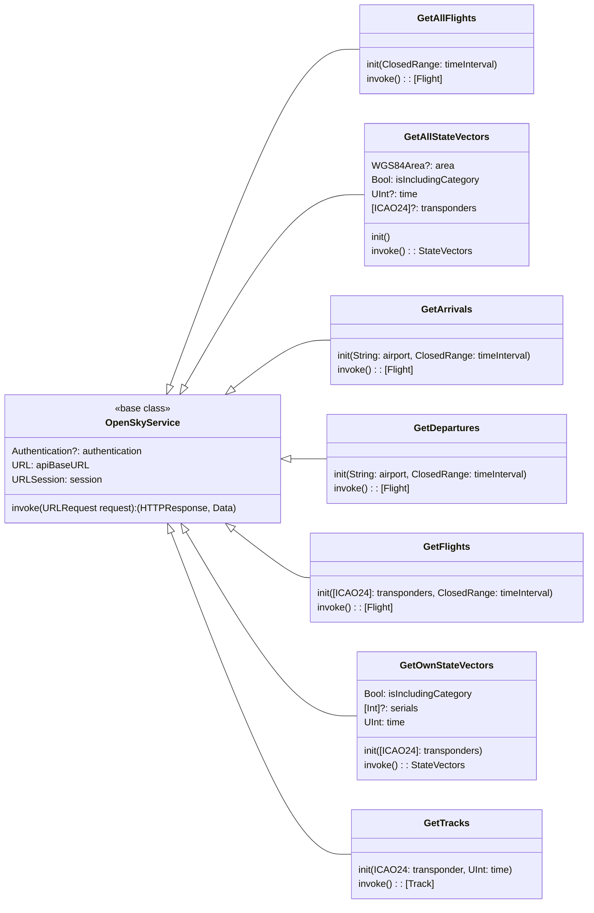

# OpenSkyAPI
Swift wrapper for the OpenSky Network API

I'm working on an internal flight-tracking project and I needed access to a couple of existing public network API sets in order to source the data for my app. This is the first of two. It provides the methods I need to access flight information for a given area and zero in on a given flight for detailed tracking.

This project demonstrates a few of useful features or facilities that I've never used before.

1. Swift package resources
2. Swift package unit-tests
3. Usage of `URLProtocol` in order to return mock data
4. Swift Concurrency based API wrappers

## OpenSky Network API Docs
[The documentation I followed in order to write this wrapper is found here.](https://openskynetwork.github.io/opensky-api/index.html)

## General Implementation Notes
There is nothing new or fancy about the wrappers themselves. I'm using `Codable` to define and interpret the data coming from the OpenSky Network API (ONA). Previous wrappers that I've created in the past for other APIs provide interfaces implemented using closures or Combine publishers. This time I decided to use the `async` interface vended from `URLSession` as part of Swift Concurrency.

Instead of having a single API object, which is what I did last time, this time I decided to use a service based approach. Thus, making each individual API endpoint vended from ONA, a separate class with a common base implementation, as shown in the diagram below.



## Mocking Data With URLProtocol
In order to easily simulate and validate network payloads from ONA, I have created a mock implementation of the `URLProtocol` named `MockURLProtocol`, which provides the implementation needed to locate and load JSON files from the test bundle and return said data as the payload for network API requests through `URLSession`.

## Bundling Resources and Unit-tests Within a Swift Package
I have two separate test classes. One for mock data (`MockOpenSkyServiceTests`) and one for running against the live service (`OpenSkyServiceTests`). The mock class utilizes `MockURLProtocol`, described above. Both the resource files and the unit-tests that rely on them are stored in the test bundle defined by the package description, instead of the main bundle for the package.

### Problems
There is an issue when running the unit test for both test classes in one testing session. I believe it has something to do with `URLProtocol` registration but I am not sure. When you try and run all of the tests from Xcode using the unit-test button in the Xcode UI, the live tests all fail with JSON decoding exceptions. If you run each of the two test class separately, there is no issue.

From the command line, if you execute a `swift test` command, half the tests will fail presumably for the same reason. Since my code is working and the test cases do run successfully when run in separate sessions, I have not spent time trying to determine and remedy the root cause of the problem. The tests are written to be independent of each other and there is no shared state or data-store between the two classes. The only commonality is the shared runtime with URLSession.

## API Usage
The APIs all optionally allow for authentication. Note that if you do not include authentication, the behavior and scope of the results will be affected. See the ONA documentation for details.

In order to provide authentication you must have registered an account with ONA and have a valid *username* and *password*. There are other limitations to the API parameters such as limits to filtering data based on time. Instead of repeating those details here, please read the original ONA documentation.

### Get AllFlights
```swift
// Calculate a date-range for the last hour (there must be a more convenient way to do this).
let now = Date()
let oneHourInterval: TimeInterval = 3_600
let dateInterval = DateInterval(start: Date(timeInterval: -oneHourInterval, since: now), end: now)
let range = UInt(dateInterval.start.timeIntervalSince1970)...UInt(dateInterval.end.timeIntervalSince1970)

// Optionally include authentication
service.authentication = Authentication(username: "Your username here",
                                        password: "Your password here")

// Fetch flight data with required time filter.
let service = try GetAllFlights(within: range)
service.authentication = auth
let flights = try await flightService.invoke()

```

### GetAllStateVectors
```swift
let service = GetAllStateVectors()

// Optionally include a geographical area as a filter, passing min/max lat/lon.
let area = OpenSkyService.WGS84Area(lamin: 31.64,
                                    lomin: -114.40,
                                    lamax: 37.0,
                                    lomax: -109.21)
service.area = area

// Optionally include authentication
service.authentication = Authentication(username: "Your username here",
                                        password: "Your password here")

// Optionally enabled the inclusion of the `category` property
// in the returned `StateVector` model. The default value is `false`.
service.isIncludingCategory = true

// Fetch and access model data
let stateVectors = try await service.invoke()
print("GetAllStateVectors returned \(stateVectors.states.count) states.")
```

### GetArrivals & GetDepartures
```swift
let service = try GetArrivals(at: "EDDF", in: 1517227200...1517230800)

or

let service = try GetDepartures(from: "EDDF", in: 1517227200...1517230800)

service.authentication = auth
let flights = try await service.invoke()
print("\(flights.count) flights.")
```

### GetFlights
```swift
// We must include an array containing at least one valid transponder code.
let transponders: [OpenSkyService.ICAO24] = [OpenSkyService.ICAO24(icaoString: "0c1b2a")]

// Calculate a date-range of 30 days or less.
let range = UInt(dateInterval.start.timeIntervalSince1970)...UInt(dateInterval.end.timeIntervalSince1970)

let service = try GetFlights(for: transponders, in: range)

// Optionally include authentication
service.authentication = Authentication(username: "Your username here",
                                        password: "Your password here")
                                        
// Fetch flight data with required time filter.
let flights = try await flightService.invoke()
```

### GetOwnStateVectors
```swift
let transponders: [OpenSkyService.ICAO24] = [OpenSkyService.ICAO24(icaoString: "0c1b2a")]
let service = GetOwnStateVectors(with: transponders)

// Optionally include authentication
service.authentication = Authentication(username: "Your username here",
                                        password: "Your password here")

// Optionally enabled the inclusion of the `category` property
// in the returned `StateVector` model. The default value is `false`.
service.isIncludingCategory = true

// Optionally filter results by number.
service.serials = [1, 2, 3, 4]

// Optionally provide timestamp for further filtering of returned data.
services.time = UInt(Date().timeIntervalSince1970)

// Fetch state-vectors
let stateVectors = try await service.invoke()
```
### GetTracks
```swift
let service = try GetTracks(for: transponder)

or

// Optionally include timestamp for historical data.
let time = UInt(dateInThePast.timeIntervalSince1970)
let service = try GetTracks(for: transponder, at: time)

// Optionally include authentication
service.authentication = Authentication(username: "Your username here",
                                        password: "Your password here")
                                        
let tracks = try await service.invoke()
```

## TODO
* I'm not a big fan of the way time is used and specified in ONA. After I put some mileage on this package, I should have some idea how best to make the use of time parameters more convenient and swifty.

* When initially coding the *arrival* and *departure* API methods I noted that the only difference between both implementations was the binary decision on whether we wanted departure or arrival information. I need to refactor to a common implementation and include a boolean or enum to switch or change the URL path.

* The only service that I have not tested is the `GetOwnStateVectors`. I need to learn a little bit more about the *serials* parameter and its proper meaning in context. Then I will be in a better position to evaluate the behavior and responses generated by ONA for this particular service.

## License
OpenSkyAPI is released under an MIT license. See [LICENSE](https://github.com/StateMachineJunkie/OpenSkyAPI/blob/main/LICENSE) for more information.
